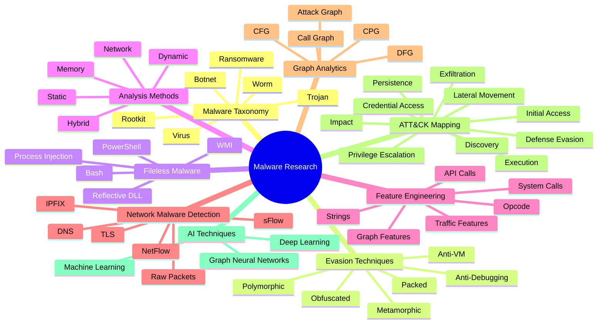

## Malware Research Laboratory

```mermaid
mindmap
  root((Malware Research))

    Malware Taxonomy
      Virus
      Worm
      Trojan
      Ransomware
      Rootkit
      Botnet

    Evasion Techniques
      Packed
      Obfuscated
      Polymorphic
      Metamorphic
      Anti-Debugging
      Anti-VM

    Fileless Malware
      PowerShell
      Bash
      WMI
      Reflective DLL
      Process Injection

    Analysis Methods
      Static
      Dynamic
      Hybrid
      Memory
      Network

    Feature Engineering
      Opcode
      API Calls
      Strings
      System Calls
      Traffic Features
      Graph Features

    Network Malware Detection
      Raw Packets
      NetFlow
      IPFIX
      sFlow
      DNS
      TLS

    Graph Analytics
      CFG
      DFG
      Call Graph
      CPG
      Attack Graph

    ATT&CK Mapping
      Initial Access
      Execution
      Persistence
      Privilege Escalation
      Defense Evasion
      Credential Access
      Discovery
      Lateral Movement
      Exfiltration
      Impact

    AI Techniques
      Machine Learning
      Deep Learning
      Graph Neural Networks
```
